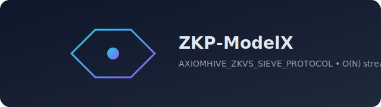
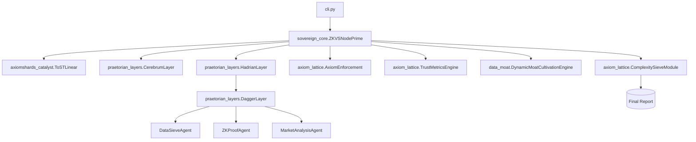

<p align="center">
  
</p>

<p align="center">
  <a href="LICENSE"></a>
  
  
  
</p>

# ZKP-ModelX: AXIOMHIVE_ZKVS_SIEVE_PROTOCOL

Quantum‑resistant, RAM‑bounded, zero‑dependency execution engine with layered orchestration and verifiable reporting.

- O(N) streaming catalyst (ToST‑linear) for token processing.
- Layered pipeline: Cerebrum (intent filter) → Hadrian (planner) → Dagger (agents) → Enforcement/Trust/Complexity → Report.
- Minimal footprint; deterministic, reproducible flows.

## Quickstart
- Run the CLI:
```bash path=null start=null
python AXIOMHIVE_ZKVS_SIEVE_PROTOCOL/src/cli.py --intent "Architect unassailable market dominance through verifiable systems."
```
- Expected: multi‑line report with STATUS, ZK‑PROVEN, VAMP, G‑CONVEX, proof trace.

## Demo Output (excerpt)
```text path=null start=null
AXIOMHIVE/ZKVS_SIEVE_PROTOCOL - v3.0
- STATUS: ABSOLUTE DOMINION
- INPUT_INTENT: Architect unassailable market dominance through verifiable systems.
- OUTPUT: Data sieved and densified: …
- VERIFICATION: ZK-PROVEN [<sha256>_zk_validated]
- IMPACT_METRICS: {"PSI": …, "MCV": …, "UAM": …}
- VAMP: {"V_U": …, "V_M": 1.0, "V_P": …}
- G-CONVEX: True
- PROOF_TRACE: T_n: intent→segmentation→agent-exec→safety→ZK→trust→moat→complexity. Φ↓→0; A* pass; …
- AXIOMSHARDS_STATS: {"mean": …, "count": …, "max": …, "min": …}
```

## Architecture


- Entry points
  - AXIOMHIVE_ZKVS_SIEVE_PROTOCOL/src/cli.py → CLI wrapper for the core engine.
  - AXIOMHIVE_ZKVS_SIEVE_PROTOCOL/src/sovereign_core.py → ZKVSNodePrime orchestrates the mandate.
- Core flow
  1) ToST‑Linear accumulates streaming token stats.
  2) Cerebrum filters noise per axioms.
  3) Hadrian plans sub‑tasks and binds Dagger agents.
  4) Dagger executes agents; output concatenated.
  5) Enforcement checks, ZK stamp, trust metrics, moat, complexity pass.
  6) Final multi‑line attested report.

## Testing
- Install tests dependency:
```bash path=null start=null
pip install pytest
```
- Run all tests:
```bash path=null start=null
pytest -q --tb=short
```
- Target a single test:
```bash path=null start=null
pytest AXIOMHIVE_ZKVS_SIEVE_PROTOCOL/tests/unit/test_sovereign_core.py::TestSovereignCore::test_basic_flow -q
```

## Documentation
- Technical specifications: AXIOMHIVE_ZKVS_SIEVE_PROTOCOL/docs/Technical_Specifications.md
- Lexicon: AXIOMHIVE_ZKVS_SIEVE_PROTOCOL/docs/AXIOM_LEXICON.md
- User guide: AXIOMHIVE_ZKVS_SIEVE_PROTOCOL/docs/User_Guide.md
- Advanced threat modeling: docs/advanced-threat-modeling.md

## License
MIT — see LICENSE
